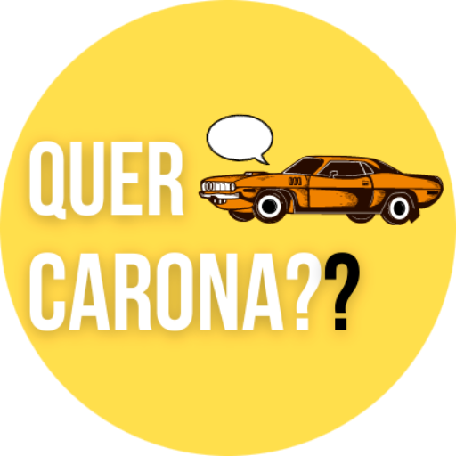
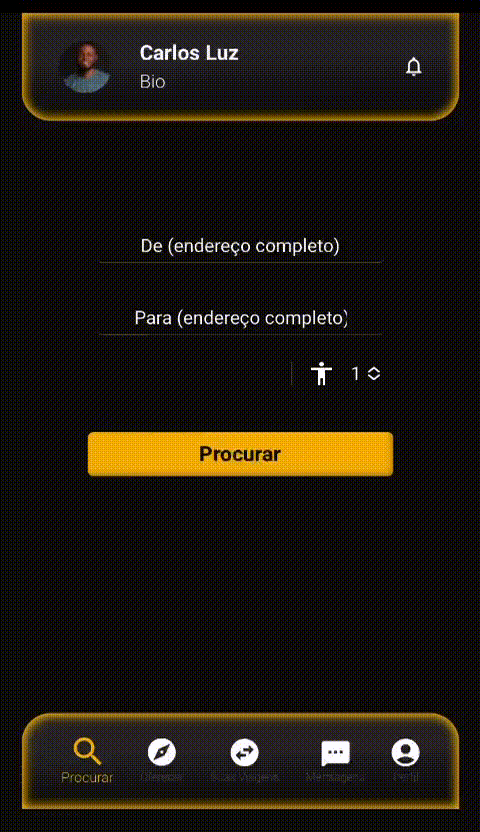
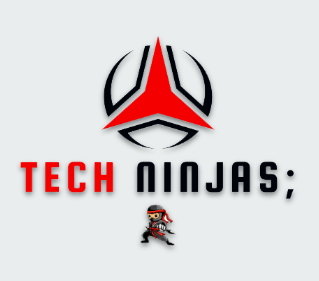
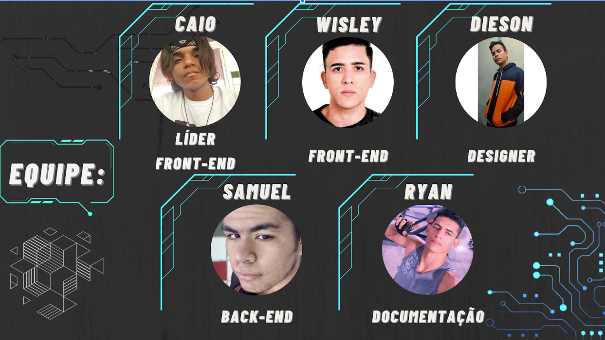

<h1 align="center">Quer Carona?</h1>
 

<h2 align="center">Projeto</h2>
<h4 align="center">
🚧 Projeto README 🚀 Em construção ... 🚧
</h4>

 

## Descrição do Projeto

  Para pessoas que necessitam se deslocar para certos locais sem precisar gastar muito, o “QUER CARONA??” é uma plataforma que permite a essas pessoas terem a oportunidade de obterem caronas de uma forma rápida, moderna e fácil de usar.
   
  Diferente das plataformas de locomoção existentes que são pagas e com valores elevados. Nosso produto tem como objetivo ser uma ferramenta grátis, tendo como o pagamento ficando a escolha do passageiro, não sendo obrigatório.

 
  
<h3 align="center">
Benefícios: 
</h3>

 

   * Oferta e procura vagas ociosas em veículos.
   * Um lugar prático, simples e rápido para o anúncio/procura de vagas.
   * Viagem com um meio de transporte mais confortável e econômico para o bolso do motorista e passageiro.
   * Mais agilidade para chegar ao trajeto, ao encontrar pessoas com o mesmo destino que o seu.
   * Mais socialização ao ter colegas de transporte, com o mesmo destino.
   * Preservação ambiental com menos veículos nas ruas emitindo CO² e mais fluidez no trânsito.  
      
 

  <h3>Demonstração das Telas Iniciais</h3>
  
 
  

  

 
  <h4 align="center">
    As seguintes ferramentas estão sendo utilizada:
  </h4>
 

  
  
  
  
  
  
  
  

 
<h2 align="center">Equipe</h2>

 
<h3>Autores</h3>

- [@WisleyASousa](https://github.com/WisleyASousa)
- [@samudebug](https://github.com/samudebug)
- [@Caio-Leto](https://github.com/Caio-Leto)
 

 
  
  
  

Projeto Integrador I/II e Programação para Internet I/II - IFPI - Picos - 2022

